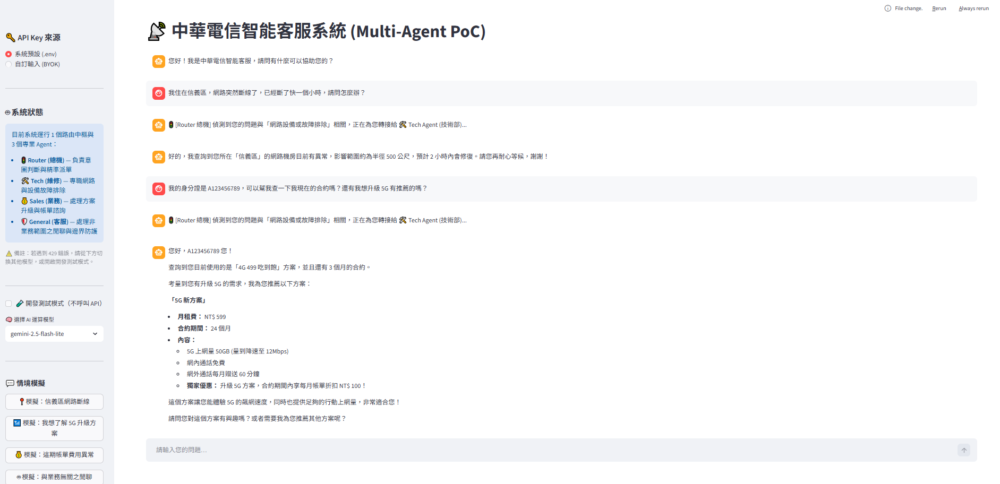

# 中華電信智能客服系統 (Multi-Agent PoC)

這是一個基於 **LangGraph** 與 **Gemini API** 打造的多代理人 (Multi-Agent) 智能客服概念驗證 (PoC) 系統。本專案旨在模擬現代電信業複雜的客訴情境，透過意圖路由與實體工具調用，實現精準、高效的自動化派單與問題解決。

## 核心架構與技術亮點 (Technical Highlights)

本專案不僅僅是串接 LLM，更著重於企業級應用的**擴充性、穩定性與可觀測性**：

*   **LangGraph 多代理路由 (Agentic Routing)：**
    *   實作中樞 `Router` 節點，精準判斷使用者意圖，並將任務動態分發給 `Tech Agent (技術部)`、`Sales Agent (業務部)` 或 `General Agent (一般客服)`。
    *   嚴格的 System Prompt Tuning，避免意圖分類漂移 (Intent Drift)，並由 General Agent 擔任邊界守門員防範越獄 (Jailbreak)。
*   **實體工具調用 (Function / Tool Calling)：**
    *   Agent 不只生成文字，更能實際呼叫外部工具 (`tools.py`)。
    *   **Tech 模組**：自動調用 `check_network_status` 查詢機房狀態，並觸發 `create_repair_ticket` 建立假工單。
    *   **Sales 模組**：調用 `query_user_plan` 查詢合約狀態，並動態連動 `recommend_5g_plan` 提供升級建議。
*   **Agent 決策可觀測性 (Observability)：**
    *   特別設計「廣播攔截與淨化機制 (`_strip_broadcasts`)」。在前端 UI 具象化 Router 的派單過程，讓使用者了解背後運作邏輯，同時確保這些 UI 廣播字串不會污染下一個 Agent 的 Context Window。
*   **企業級維運彈性 (Enterprise Readiness)：**
    *   **BYOK (Bring Your Own Key)**：支援 `.env` 預設金鑰或前端動態注入，保障公有雲部署的安全性。
    *   **動態模型切換 (Dynamic Routing)**：可根據需求在 `gemini-2.5-flash` 與 `gemini-2.5-flash-lite` 之間無縫切換，平衡推理能力與 API Quota (RPM 限制)。
    *   **開發測試模式 (Mock Mode)**：實作本地端攔截層，在開發期完全阻斷 API 請求，節省配額並加速 UI/UX 迭代。

## 系統架構圖 (Workflow)

```
用戶輸入 -> Router (總機判斷意圖)
                  |-> Tech Agent   [Tool: 查機房 / 建工單]
                  |-> Sales Agent  [Tool: 查合約 / 推方案]
                  |-> General Agent (邊界防範 / 委婉拒絕)
```

## 技術棧 (Tech Stack)

*   **前端介面：** Streamlit
*   **AI 核心：** Google GenAI SDK (`gemini-2.5-flash` 系列)
*   **Agent 框架：** LangGraph, LangChain (`ToolNode`, `StateGraph`)
*   **語言：** Python 3.10+

## 系統截圖 (Screenshots)



## 快速啟動 (How to Run)

1. 安裝依賴套件：
   ```bash
   pip install -r requirements.txt
   ```

2. 設定 API Key，在專案根目錄建立 `.env`：
   ```
   GEMINI_API_KEY=你的金鑰
   ```

3. 啟動應用：
   ```bash
   streamlit run multi_agent_app.py
   ```
